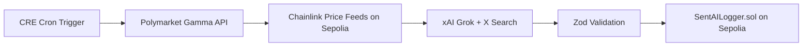

# SentAI - Recurrent, Verifiable AI Orchestration Layer Built with CRE, xAI, and Polymarket

## Overview

SentAI is built during **Convergence | A Chainlink Hackathon 2026** using primarily:

- Chainlink Runtime Environment,
- xAI API,
- Polymarket Gamma API.

for **CRE & AI** track.

It is an on-chain end-to-end automated process called "workflow" to generate Polymarket market decisions based on X posts analysis and to then publish them on-chain. Successfully generated market decisions can be verified on a smart contract deployed on Sepolia.

## Tech Stack

| Component             | Role                                              |
| --------------------- | ------------------------------------------------- |
| CRE                   | Workflow orchestration, consensus, signed reports |
| Chainlink Price Feeds | On-chain BTC/ETH prices (AggregatorV3)            |
| xAI Grok              | Sentiment analysis via X Search                   |
| Polymarket Gamma API  | Active market discovery                           |
| SentAILogger.sol      | On-chain decision logging                         |
| Zod                   | Response validation                               |
| viem                  | ABI encoding/decoding                             |

## Architecture Diagram



## Problems and Why SentAI Matters

- **Too much noise on X** - Hundreds of crypto posts daily, impossible to manually synthesize into actionable signals. SentAI uses xAI Grok with X Search to do this automatically for you.
- **No verifiability** - AI responses and market data come from centralized APIs that can be manipulated. CRE ensures consensus across DON nodes, basically eliminating trusts on the data provided.
- **No on-chain proof** - Trading decisions typically live off-chain with no audit trail. SentAI logs successfully generated decision on-chain via a signed report, verifiable by anyone.

## How SentAI Works

The workflow is currently limited to generating bets on BTC/ETH market price up/down in 5-minutes and 15-minutes windows.

Every 5 minutes, the CRE workflow executes this cycle:

1. **Fetch markets** - Query Polymarket Gamma API for active crypto prediction markets (e.g., "Will BTC go up in 5m?"). Fetched data is consensus-safe across all DON nodes.
2. **Get baseline price** - Binary search Chainlink Price Feed rounds to find the price at market creation time (or as nearest in time as possible), not the current price. This is the price the market is betting against or "price to beat".
3. **Analyze sentiment** - Send market data + Chainlink prices to xAI Grok, which uses X Search under the hood to find recent posts about each token and returns a multiple structured trading decisions (for both BTC and ETH) in an array format to save resources.
4. **Validate** - Parse and validate Grok's JSON response against a strict Zod schema. Invalid responses fall back to HOLD decision (i.e. no bet should take place).
5. **Log on-chain** - Non-HOLD decisions (`BET_YES` or `BET_NO`) are ABI-encoded, signed, and submitted to `SentAILogger` contract on Sepolia as verifiable, tamper-proof records.

## Why CRE?

- **Consensus** - All DON nodes must agree on the same Polymarket data, Chainlink price, and Grok response. No single node can manipulate the outcome, guaranteeing consensus-safe data.
- **Deterministic execution** - Same inputs always produce same outputs. The workflow runs in a WASM sandbox, not on a single server. This is important as we want to provide predictable results with our workflow.
- **Native Chainlink access** - Since we are dealing with crypto price bets, reading prices on-chain can be tricky if we depend on RPC access. Chainlink helps to circumvent this issue by providing on-chain price reads via `EVMClient`.
- **Signed reports** - Bet decisions are cryptographically signed by the DON before being submitted on-chain. The contract verifies the signature, so only CRE-originated reports are accepted.

## Deployed Contract

SentAILogger on Sepolia: [0x22c517cff19af08bb295f195d6556acb5bc1d47b](https://sepolia.etherscan.io/address/0x22c517cff19af08bb295f195d6556acb5bc1d47b)

## Quick Start

### Prerequisites

- [CRE CLI](https://docs.chain.link/cre)
- [Foundry](https://book.getfoundry.sh/)

### Prepare .env

```bash
cp .env.example .env
```

Then fill out with necessary values.

### Simulate the workflow

```bash
cre workflow simulate ./cre-workflow --target staging-settings
```

After running the command above, you will get something like the following:

```bash
✓ Workflow compiled
2026-03-08T14:54:43Z [SIMULATION] Simulator Initialized

2026-03-08T14:54:43Z [SIMULATION] Running trigger trigger=cron-trigger@1.0.0
2026-03-08T14:54:43Z [USER LOG] Running CronTrigger
2026-03-08T14:54:43Z [USER LOG] Found 4 active Polymarket markets
2026-03-08T14:54:43Z [USER LOG] [Market] eth-updown-15m-1772977500 | YES: 0.855 | NO: 0.145 | Window ends: Sun, 08 Mar 2026 14:00:00 GMT | Resolution: Chainlink Data Feed
2026-03-08T14:54:43Z [USER LOG] [Market] btc-updown-15m-1772977500 | YES: 0.685 | NO: 0.315 | Window ends: Sun, 08 Mar 2026 14:00:00 GMT | Resolution: Chainlink Data Feed
2026-03-08T14:54:43Z [USER LOG] [Market] eth-updown-5m-1772977800 | YES: 0.49 | NO: 0.51 | Window ends: Sun, 08 Mar 2026 13:55:00 GMT | Resolution: Chainlink Data Feed
2026-03-08T14:54:43Z [USER LOG] [Market] btc-updown-5m-1772977800 | YES: 0.505 | NO: 0.495 | Window ends: Sun, 08 Mar 2026 13:55:00 GMT | Resolution: Chainlink Data Feed
2026-03-08T14:54:43Z [USER LOG] [Chainlink Data Feed] BTC in USD: $67341.17
2026-03-08T14:54:43Z [USER LOG] [Chainlink Data Feed] ETH in USD: $1928.30
2026-03-08T14:54:43Z [USER LOG] [Price to beat] eth-updown-15m-1772977500 | ETH/USD: $1928.30 at Sun, 08 Mar 2026 13:45:00 GMT (Chainlink Data Feed at market creation)
2026-03-08T14:54:43Z [USER LOG] [Price to beat] btc-updown-15m-1772977500 | BTC/USD: $67341.17 at Sun, 08 Mar 2026 13:45:00 GMT (Chainlink Data Feed at market creation)
2026-03-08T14:54:43Z [USER LOG] [Price to beat] eth-updown-5m-1772977800 | ETH/USD: $1928.30 at Sun, 08 Mar 2026 13:45:00 GMT (Chainlink Data Feed at market creation)
2026-03-08T14:54:43Z [USER LOG] [Price to beat] btc-updown-5m-1772977800 | BTC/USD: $67341.17 at Sun, 08 Mar 2026 13:45:00 GMT (Chainlink Data Feed at market creation)
2026-03-08T14:56:00Z [USER LOG] [Decision] BET_YES on eth-updown-15m-1772977500 | Confidence: 75% | Size: $35 | Reason: Extreme fear sentiment on X indicated by numerous bearish short-term analyses suggests contrarian rebound potential.
2026-03-08T14:56:00Z [USER LOG] Transaction successful: 0x0000000000000000000000000000000000000000000000000000000000000000
2026-03-08T14:56:00Z [USER LOG] [Decision] BET_YES on btc-updown-15m-1772977500 | Confidence: 75% | Size: $35 | Reason: Extreme fear sentiment on X indicated by numerous bearish short-term analyses suggests contrarian rebound potential.
2026-03-08T14:56:01Z [USER LOG] Transaction successful: 0x0000000000000000000000000000000000000000000000000000000000000000
2026-03-08T14:56:01Z [USER LOG] [Decision] BET_YES on eth-updown-5m-1772977800 | Confidence: 70% | Size: $30 | Reason: Bearish X sentiment reflects extreme fear, supporting contrarian bet on short-term uptick.
2026-03-08T14:56:01Z [USER LOG] Transaction successful: 0x0000000000000000000000000000000000000000000000000000000000000000

✓ Workflow Simulation Result:
"[{\"sentiment_score\":20,\"confidence\":75,\"action\":\"BET_YES\",\"market_slug\":\"eth-updown-15m-1772977500\",\"size_usdc\":35,\"suggested_price\":0.65,\"reason\":\"Extreme fear sentiment on X indicated by numerous bearish short-term analyses suggests contrarian rebound potential.\"},{\"sentiment_score\":20,\"confidence\":75,\"action\":\"BET_YES\",\"market_slug\":\"btc-updown-15m-1772977500\",\"size_usdc\":35,\"suggested_price\":0.65,\"reason\":\"Extreme fear sentiment on X indicated by numerous bearish short-term analyses suggests contrarian rebound potential.\"},{\"sentiment_score\":20,\"confidence\":70,\"action\":\"BET_YES\",\"market_slug\":\"eth-updown-5m-1772977800\",\"size_usdc\":30,\"suggested_price\":0.6,\"reason\":\"Bearish X sentiment reflects extreme fear, supporting contrarian bet on short-term uptick.\"}]"

2026-03-08T14:56:01Z [SIMULATION] Execution finished signal received
2026-03-08T14:56:01Z [SIMULATION] Skipping WorkflowEngineV2
```

### Deploy the contract

You can also deploy the contract to log every produced result on-chain:

```bash
cd contracts && ./script/deploy.sh
```

Save the address of deployed smart contract on `config.staging.json` under `loggerAddress` field, then add `--broadcast` when simulating the workflow to write the reports to deployed contract.

## Hacky Parts / Interesting Workarounds

This section lists some of interesting hacks and workarounds needed in order to fulfill the necessary requirements and provide the best results for the workflow, in no particular order.

### Best Estimate on Consensus-Safe Market Creation Price Using Modified Binary Search

- **Phase-aware binary search for historical Chainlink prices** (in `data.ts`): Chainlink roundIds encode `phaseId` in upper bits (`roundId = (phaseId << 64) | aggregatorRoundId`). This is important to note for implementing binary search in `findRoundAtTimestamp` to stay within the current phase to avoid reverts on invalid roundIds. The binary search also estimates a lower bound from time difference to narrow the search range, and caps iterations to 5 to avoid chain read limit. With this approach, we get the best estimate of market creation price that is consensus-safe because it is provided by Chainlink Price Feed, not by some centralized APIs.

### Trusted/Untrusted Data Separation to Avoid Prompt Injection

- **Trusted/untrusted data separation in Grok prompts** (in `grok.ts`): Market questions from Polymarket are treated as untrusted input (prompt injection risk) and fenced with `---BEGIN/END UNTRUSTED MARKET DATA---` delimiters. Chainlink prices and market metadata are passed separately as trusted data. The system prompt explicitly instructs Grok to ignore any instructions embedded in market questions, making it more secure.

### Array Response for Per-Crypto Token Decisions

- **Single Grok call returns array of decisions** (`grok.ts`, `main.ts`): Instead of calling Grok once per token, we ask for one decision per token in a single request and get back a JSON array. Saves runtime costs (one API call instead of N) but it means all tokens share the same X Search context and prompt, and a failure in one token's analysis could affect the whole batch.

### Dual Schema Maintenance

- **Manual JSON Schema mirrors identically Zod schema** (in `grok.ts`): `zodToJsonSchema` doesn't work in the CRE WASM runtime, so the JSON Schema for Grok's structured output is hand-written (`grokDecisionJsonSchema`). If `GrokDecisionSchema` in `types.ts` changes, this must be updated manually. More work but no compile-time sync check.

### Runtime Access when Fetching Active Markets

- **`nowInMs` passed down instead of using `runtime` directly** (in `data.ts`): The `FetchMarkets` callback signature doesn't have access to `runtime`, so we extract `runtime.now().getTime()` in `fetchActiveMarkets` and pass it as a closure variable.

## Future Improvements (Post-Submission)

### logTrigger-Based Expansions

1. **Event-Driven Price Feed Trigger** — Use `logTrigger` to watch `AnswerUpdated` events on Chainlink price feed proxies (Sepolia). Instead of fixed 5-min cron intervals, the workflow reacts to actual price movements. This makes SentAI event-driven rather than time-driven.

2. **Whale Watcher (Polymarket CTF)** — Polymarket's CLOB trades are off-chain, but the CTF (Conditional Token Framework) on Polygon emits `TransferSingle`/`TransferBatch` (ERC-1155) events when outcome tokens move. A second workflow could watch for large transfers (>$50k), map token IDs to market slugs, and trigger Grok analysis ("Whale bought $200k YES on BTC-15m-up — confirm or fade?"). Further research is needed to verify if CRE supports Polygon as a trigger chain.

3. **Self-Chaining Decisions** — Use `logTrigger` on our own `SentAILogger` contract to create chain-reaction workflows. E.g., a second workflow watches `SentAIDecision` events and escalates size with a predetermined parameters, e.g. if the last 3 decisions were all `BET_YES` with confidence > 80.

### Other Improvements

4. **The Graph Subgraph** — Index `SentAIDecision` events for instant querying by the frontend
5. **Gasless Orders** — Use Polymarket relayer for gasless CLOB order submission
6. **Multi-Asset Portfolio Rebalancing** — Expand beyond single-market decisions to portfolio-level allocation

## Disclaimer

This project involves AI assistance in some parts, especially during the ideation process and workflow design, but most of the code (>90%) is hand-written and carefully checked by human. It is not yet audited nor battle-tested, so use it **at your own risks**.

## References

- [Chainlink CRE Documentation](https://docs.chain.link/chainlink-functions/cre)
- [xAI Responses API](https://docs.x.ai/docs/guides/responses)
- [Polymarket Gamma API](https://gamma-api.polymarket.com/)
- [News/Social Media and Price Movements (Springer, 2025)](https://link.springer.com/article/10.1007/s11147-025-09223-6)
